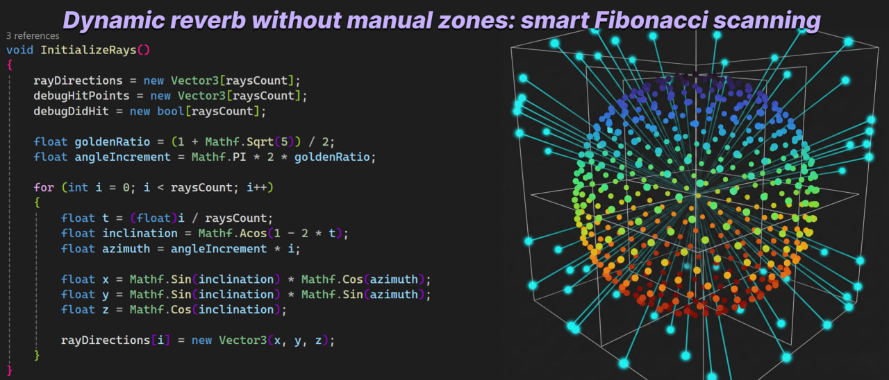

# 🦇 $\color{orange}{\text{Unity FMOD Procedural Acoustics}}$


> **A lightweight, raycast-based volumetric audio system for Unity & FMOD.** > Automates Reverb, Room Size, and Occlusion logic without the need for manual trigger zones or baked geometry.

---

## The Problem
In complex level design, placing hundreds of **Reverb Zones** and **Occlusion Triggers** is time-consuming and prone to human error. Static zones often fail to represent dynamic changes, such as opening a door or destroying a wall.

## The Solution
This system gives audio sources "eyes". It uses **Volumetric Raycasting** and **Fibonacci Sphere Sampling** to scan the surrounding geometry in real-time, dynamically calculating:
* **Enclosure Factor:** Are we outdoors or in a tight corridor?
* **Room Size:** How large is the space around the player?
* **Diffraction & Occlusion:** Is the sound source blocked? Does sound wrap around the corner?

---

## ⚙️ Performance & Optimization Architecture
One of the main challenges with volumetric audio is CPU cost. To ensure the system scales to hundreds of emitters without impacting FPS, I implemented a **three-layer optimization strategy**:

### 1. Asynchronous Time Slicing (The "Sweet Spot")
Instead of running heavy raycasts every frame, the scanner operates on a throttled tick rate (default: **5Hz** or every 0.2s).
* **Why:** Room acoustics rarely change instantly. 5Hz provides a responsive feel while reducing CPU load by **~90%** compared to per-frame updates.
* **Smoothing:** To hide the low tick rate, all FMOD parameters are interpolated using `Mathf.Lerp` and `Mathf.SmoothDamp`, ensuring the audio transitions feel instant and fluid to the player.

### 2. State & Distance Culling (Sleep Mode)
The system actively manages its own state to avoid redundant calculations:
* **IsPlaying Check:** Emitters that are not playing audio (or are virtualized by FMOD) perform **zero** raycasts.
* **Distance Culling:** Logic is fully suspended for sources beyond the listener's hearing range.

```csharp
// Snippet from FMODSmartReverb.cs & FMODSmartOcclusion.cs

// 1. IsPlaying Check: If the sound isn't playing, don't scan.
if (!isGlobal && targetEmitter != null && !targetEmitter.IsPlaying()) return;

// 2. Distance Culling: If player is out of range, stop processing.
float distance = Vector3.Distance(listener.position, transform.position);
if (emitter.OverrideAttenuation && distance > emitter.OverrideMaxDistance) return;
```

### 3. Asymmetric Ray Counts (LOD)
* **The Listener (Global Reverb):** Uses a high-fidelity **Fibonacci Sphere (30+ rays)** to accurately map the room size and enclosure.
* **Emitters (Occlusion):** Use a lightweight **Volumetric Cone (~6 rays)** just to determine line-of-sight and diffraction.

---

## 📊 Technical Deep Dive

### 1. The "Ears": Fibonacci Sphere Sampling
Instead of using random raycasts (which clump together) or heavy box-casts, the `FMODSmartReverb` component uses a **Fibonacci Lattice** algorithm. This generates mathematically perfect, equidistant points on a sphere.

| Sphere Generation | Scanning Logic |
| :---: | :---: |
|  |  |

**Why this matters:**
* **Uniformity:** We get a scientifically accurate "snapshot" of the environment density with as few as 30 rays.
* **Math:** Uses the Golden Ratio ($\phi$) to distribute rays evenly.

```csharp
// Snippet from FMODSmartReverb.cs
float goldenRatio = (1 + Mathf.Sqrt(5)) / 2;
float angleIncrement = Mathf.PI * 2 * goldenRatio;

for (int i = 0; i < raysCount; i++) 
{
    float t = (float)i / raysCount;
    float inclination = Mathf.Acos(1 - 2 * t);
    float azimuth = angleIncrement * i;

    // Convert spherical coordinates to Cartesian (x, y, z)
    float x = Mathf.Sin(inclination) * Mathf.Cos(azimuth);
    float y = Mathf.Sin(inclination) * Mathf.Sin(azimuth);
    float z = Mathf.Cos(inclination);
    
    rayDirections[i] = new Vector3(x, y, z);
}
```
### 2. The "Voice": Volumetric Occlusion & Diffraction
Standard Unity occlusion is binary (Blocked/Unblocked). This system uses `FMODSmartOcclusion` to simulate sound diffraction — the way audio waves bend around obstacles.

| Volumetric Raycasting | Logic States |
| :---: | :---: |
|  |  |

**Key Features:**
* **Volumetric Cone:** Casts a spread of rays towards the listener. If the center is blocked but edges are clear, the sound is "muffled" rather than silent.
* **Smart Corner Logic:** Prevents false occlusion when the player stands next to a wall but has a clear line of sight to the source.
* **Diffraction Simulation:** Calculates how far "behind" an obstacle the listener is and applies a low-pass filter (LPF) curve accordingly.

```csharp
// Snippet from FMODSmartOcclusion.cs
// Prevents self-occlusion when standing right next to a wall
float distFromHitToTarget = targetDist - hit.distance;
bool isNearField = (distFromHitToTarget < nearFieldThreshold) && (!centerIsBlocked);

if (isNearField) {
    // Ignore this hit (Treat as clear path)
} else {
    blockedCount++;
}
```
---

## Project Structure
The repository is organized to separate core logic from gameplay implementations.

```text
Unity-FMOD-Procedural-Acoustics/
├── Core/
│   ├── FMODSmartReverb.cs      # Main scanner. Calculates Enclosure & Room Size.
│   └── FMODSmartOcclusion.cs   # Per-object occlusion & diffraction logic.
├── Components/
│   └── FMODAmbienceManager.cs  # Example: Mixes Outdoor/Indoor loops based on scanner data.
└── content/                    # Documentation images.
```
## Integration Guide

### 1. Setup: Smart Reverb (Dual Mode)
The `FMODSmartReverb` component operates in two modes to solve the classic **"Emitter vs. Listener"** acoustic dilemma.

**A. Global Mode (The "Listener" Approach)**
* **Attach to:** Player Character or Camera.
* **Settings:** Check `Is Global` ☑️.
* **Function:** Drives **Global FMOD Parameters** affecting the entire mix (e.g., Master Reverb Bus). Scans the environment around the *Player*.

**B. Local Mode (The "Hybrid" Approach)**
* **Attach to:** A specific GameObject (e.g., a Radio inside a small booth).
* **Settings:** Uncheck `Is Global` ⬜.
* **Function:** Drives **Local Parameters** on that specific Event Instance.
* **Why use this:** Allows a sound source to have "dry" acoustics if it's in a small room, even if the player is standing in a massive hall listening to it.

**Configuration:**
* **Layers:** Set the `Environment Layer` to include walls/static geometry.
* **Calibration:** Use the Animation Curves to tune how sensitive the system is to open spaces vs. tight corridors.

### 2. Setting up Emitters (Sound Sources)
Attach `FMODSmartOcclusion` to any GameObject with an `FMOD Studio Event Emitter`.
* **Occlusion Parameter:** Create a continuous parameter in FMOD (0.0 = Open, 1.0 = Occluded).
* **Diffraction:** Enable this to allow sound to "wrap" around pillars and corners.

### 3. Procedural Ambience (Optional)
Use the `FMODAmbienceManager` to automatically blend between "Forest" and "Bunker" ambience loops without placing a single trigger volume. It reads the `EnclosureFactor` from the Reverb scanner directly.

```csharp
// Example from FMODAmbienceManager.cs
// Automatically blends ambience based on physical room scanning
float enclosure = scannerSource.EnclosureFactor;
float targetMix = Mathf.InverseLerp(outdoorThreshold, indoorThreshold, enclosure);
ambienceEmitter.SetParameter(mixParameterName, targetMix);
```
## Requirements
* Unity 2021.3 or higher.
* FMOD for Unity plugin (2.02+).

## License
This project is licensed under the MIT License - see the [LICENSE](LICENSE) file for details.

---
*Created for the Technical Sound Design portfolio. Exploring the intersection of code, math, and immersion.*

## About the Author
Ivan Stepanov — Technical Sound Designer & Developer

*  **LinkedIn:** [linkedin.com/in/sound-designer-ivan](https://www.linkedin.com/in/sound-designer-ivan/)
